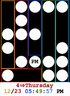

Smart Bits
==========
SmartBits is a watchface for the [Pebble](http://getpebble.com) smartwatch
showing the time and date as rows and columns of bits.

It is available for Pebble Original/Steel, and for Pebble Time (not Time Round).

**Important**: This application will run for the Pebbles using a **2.0** or **3.0** SDK.
For SDK **1.x**, see [SDK-1.x branch](https://github.com/Gustave-Monod/SmartBits/tree/SDK-1.x).

## How to install

Check out [cloudpebble.net](https://cloudpebble.net) and create a new 3.0 empty
project. Add a new file with the content of
[`src/SmartBits.c`](https://github.com/GusMonod/SmartBits/blob/master/src/SmartBits.c)
and build for aplite (Pebble Original/Steel) and/or basalt (Pebble Time).

## How to read

The first column displays the month, the second the day of the month, the
third shows the hours, the fourth the minutes and the last one displays the
seconds. Finally, the three unused bits are used to show the week day (1 to 7
=> Monday to Sunday).

### Note

The display also works in 24 hour mode
(the PM dot is then used for the most significant bit).

## Distribution

Provided "as is". *No warranties*!

If you use the sources of this repo as base for your own watchface/app:

* Please mention you used it with a link to this repo.
* Do not use any watchfaces/apps that results of it for commercial purpose.
* Share YOUR sources.
